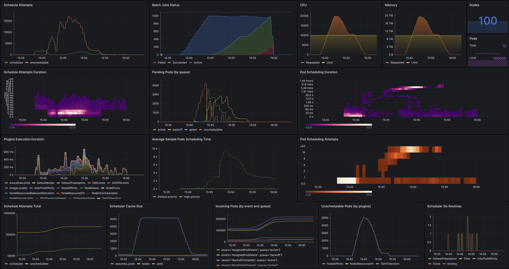

# Kube Schedulers

This project provides a workbench to test the performance of the [Kubernetes scheduler](https://github.com/kubernetes/community/blob/2709897c5ad82532f9758eefe5d93a2182957281/contributors/devel/sig-scheduling/scheduler_queues.md), and other batch schedulers or queue managers, such as [Kueue](https://kueue.sigs.k8s.io).
It particularly focuses on testing how their performance scale w.r.t. the number of Nodes and batch Jobs, but also w.r.t. the Jobs parallelism, i.e. the number of Pods per Job. 

The workbench includes these core components:
* [KWOK](https://kwok.sigs.k8s.io)
* [Prometheus Operator](https://prometheus-operator.dev)
* [kube State Metrics](https://kubernetes.io/docs/concepts/cluster-administration/kube-state-metrics/)
* [Grafana](https://grafana.com)

It also includes the following components as part of the SUT (System Under Test):
* [Kueue](https://kueue.sigs.k8s.io)
* [scheduler-plugins](https://github.com/kubernetes-sigs/scheduler-plugins) (for the coscheduling plugin)

The performance are observed via the Prometheus metrics exposed by each component, and are made accessible via the [dashboard_scheduling.yaml](./config/grafana/dashboard_scheduling.yaml) Grafana dashboard, e.g.:



## Setup

You can set the workbench up by running the following command:

```console
$ make setup
```

Note this also creates a KinD cluster currently, though it should be possible to deploy the workbench on any existing Kubernetes cluster. 

## Test

You can run the test for each individual component by running the commands listed below.

### Kubernetes Scheduler

```console
$ make test-kube-scheduler
```

### Coscheduling Plugin

```console
$ make test-cosheduling
```

### Kueue

```console
$ make test-kueue
```
